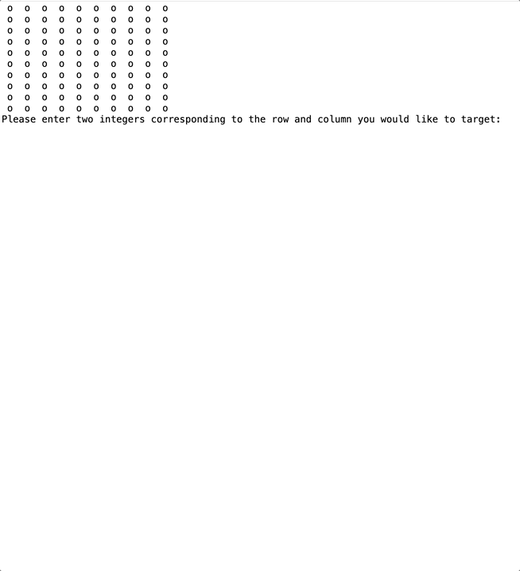

# MINESWEEPER

## DEMO



## Requirements / Purpose

* Create a 10x10 grid for the Minesweeper game.
* Randomly place 10 mines within the grid.
* Allow the user to input coordinates to check for a mine.
* Display the number of mines surrounding the selected location (0-9).
* If the selected location contains a mine, display "boom!" and end the game.
* If all non-mine squares are revealed, declare the game as won.
* After each user command, render the grid with updated information.
* Implement a cascading reveal feature for empty squares, revealing all surrounding squares recursively.
* Run the game loop until either a mine is hit or the game is won.

## Build Steps

* Run Main.java

## Design Goals / Approach

* My first project using Object-Orientated Design
* Used 2 secondary classes: Cell.java, Grid.java and Main.java

## Features

* The App randomly generates a 10x10 grid and starts a new game
* Turn-based targeting to reveal if each Cell is a Mine. 2 separately inputted integers 0-9 will be confirmed each turn.
* If either of the values inputted are outside of the aforementioned bounds, then the user is prompted with “invalid numbers” and gets to re-try
* All cells are initially “o”
* If a cell is revealed not to be a mine, nor to being in the direct vicinity of a mine - the Cell will appear as “+”
* Additionally, this Cell will continuously reveal all other “+” Cells as long as each cell is in the direct vicinity of the chain.
* If a cell is revealed to be a mine, it will show as “X”
* Once this happens - the console will prompt the user whether to play again

## Known issues

* The coordinates are confusing and should have a visual grid breakdown shown
* Impossible to restart game in App after saying no to the ‘would you like to play again’ prompt

## Future Goals

* Allow for bigger grid sizes
* Add in Colour and number grid

## Struggles
* This was my first project using Object-Orientated Design. It solidifed my understanding of classes, instances of classes and how their methods & properties work.
* The recursive function took a bit of troubleshooting but I got there in the end
```java
public void recursiveFunction(int a, int b) {
        if (!getCell(a, b).checkRevealed() && !getCell(a,b).checkIfMine()) {  
            getCell(a, b).revealCell();

            
         if(getCell(a,b).getMinesInVicinity() == 0) {
                for (int i = a - 1; i <= a + 1; i++) {
                    if (i < 0 || i >= this.length) continue;
                    for (int j = b - 1; j <= b + 1; j++) {
                        if (j < 0 || j >= this.width) continue;
                        if (i == a && j == b) continue;

                        recursiveFunction(i, j);
                    }
                }
             }
        }
    }

```
